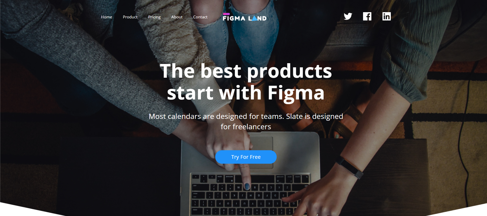

# FigmaLand - Modern Landing Page



## 📋 Table of Contents

- [Overview](#overview)
- [Features](#features)
- [Technologies Used](#technologies-used)
- [Project Structure](#project-structure)
- [Installation & Setup](#installation--setup)
- [Usage](#usage)
- [Sections Overview](#sections-overview)
- [Interactive Features](#interactive-features)
- [Responsive Design](#responsive-design)
- [Browser Support](#browser-support)
- [Contributing](#contributing)
- [License](#license)

## 🌟 Overview

FigmaLand is a modern, responsive landing page designed for a productivity and design tool. The website showcases a clean, professional design with interactive features, smooth animations, and a mobile-first approach. Built with vanilla HTML, CSS, and JavaScript, it demonstrates best practices in web development and user experience design.

## ✨ Features

### 🎨 Design Features
- **Modern UI/UX**: Clean, minimalist design with professional typography
- **Responsive Layout**: Mobile-first design that works on all devices
- **Interactive Elements**: Hover effects, smooth transitions, and engaging animations
- **Professional Color Scheme**: Consistent brand colors with CSS custom properties
- **Optimized Images**: Properly sized and optimized assets for fast loading

### 🚀 Interactive Features
- **Mobile Navigation**: Responsive hamburger menu for mobile devices
- **Video Player**: Custom video player with play/pause controls
- **Testimonial Carousel**: Auto-rotating testimonials with manual navigation
- **Contact Form**: Client-side validation with modal feedback
- **Smooth Scrolling**: Anchor-based navigation with smooth scroll behavior

### 📱 Responsive Features
- **Mobile-First Design**: Optimized for mobile devices first
- **Flexible Grid System**: CSS Grid and Flexbox for modern layouts
- **Breakpoint System**: Multiple breakpoints for different screen sizes
- **Touch-Friendly**: Optimized for touch interactions on mobile devices

## 🛠 Technologies Used

- **HTML5**: Semantic markup with modern HTML elements
- **CSS3**: 
  - CSS Grid & Flexbox for layouts
  - CSS Custom Properties (Variables)
  - Media Queries for responsive design
  - Transitions and animations
- **JavaScript (ES6+)**:
  - DOM manipulation
  - Event handling
  - Form validation
  - Interactive components
- **Google Fonts**: Open Sans font family
- **SVG Icons**: Scalable vector graphics for crisp icons

## 📁 Project Structure

```
figmaLand/
├── index.html              # Main HTML file
├── styles.css              # Main stylesheet
├── index.js                # Main JavaScript file
├── README.md               # Project documentation
└── assets/
    ├── icons/              # SVG icons and graphics
    │   ├── logo.svg
    │   ├── play-button.svg
    │   ├── pause-button.svg
    │   ├── social media icons
    │   └── contact icons
    ├── images/             # Photos and images
    │   ├── header-wrap.jpg
    │   ├── macbook.png
    │   ├── screen.jpg
    │   ├── subscribe.png
    │   └── partner logos
    └── video/              # Video assets
        └── video.mp4
```

## 🚀 Installation & Setup

### Prerequisites
- Modern web browser (Chrome, Firefox, Safari, Edge)
- Local web server (optional, for full functionality)

### Quick Start

1. **Clone or Download**
   ```bash
   git clone <repository-url>
   # or download and extract ZIP file
   ```

2. **Navigate to Project Directory**
   ```bash
   cd figmaLand
   ```

3. **Open in Browser**
   - **Option 1**: Double-click `index.html`
   - **Option 2**: Use a local server (recommended)
     ```bash
     # Using Python
     python -m http.server 8000
     
     # Using Node.js
     npx serve .
     
     # Using PHP
     php -S localhost:8000
     ```

4. **Access the Website**
   - Direct file: `file:///path/to/figmaLand/index.html`
   - Local server: `http://localhost:8000`

## 🎯 Usage

### Navigation
- **Desktop**: Use the top navigation menu to jump to different sections
- **Mobile**: Tap the hamburger menu (☰) to access navigation options
- **Smooth Scrolling**: Click any navigation link for smooth scrolling to sections

### Interactive Elements
- **Video Player**: Click the video thumbnail to play/pause the demonstration video
- **Testimonials**: Navigate manually using dots or wait for auto-rotation
- **Contact Form**: Fill out and submit the form to see validation in action
- **Social Links**: Click social media icons to visit respective platforms

## 📑 Sections Overview

### 1. **Header & Hero Section**
- **Navigation**: Logo, menu items, and social media links
- **Hero Content**: Main headline, description, and call-to-action button
- **Background**: Large hero image with overlay text

### 2. **Features Section**
- **Feature Cards**: Three main features with icons and descriptions
- **Video Demo**: Interactive video player showcasing the product
- **Responsive Grid**: Features adapt to different screen sizes

### 3. **Promotion Section**
- **Product Showcase**: MacBook image with descriptive content
- **Call-to-Action**: Prominent button for user engagement
- **Responsive Layout**: Side-by-side on desktop, stacked on mobile

### 4. **Newsletter Subscription**
- **Email Signup**: Input field with subscribe button
- **Responsive Form**: Adapts to different screen sizes
- **Visual Content**: Supporting image and descriptive text

### 5. **Partners Section**
- **Client Logos**: Display of partner/client company logos
- **Responsive Grid**: Shows different numbers of logos per row
- **Mobile Optimization**: Shows only top 3 partners on mobile

### 6. **Testimonials**
- **Customer Reviews**: Rotating testimonials with user information
- **Auto-Carousel**: Automatically changes every 5 seconds
- **Manual Navigation**: Clickable dots for manual control

### 7. **Pricing Plans**
- **Three Tiers**: Free, Standard, and Business plans
- **Feature Lists**: Detailed features for each plan
- **Highlighted Plan**: Standard plan featured as recommended

### 8. **Contact Section**
- **Contact Form**: Name, email, and message fields with validation
- **Address Information**: Physical address, phone, and email
- **Google Maps**: Embedded map showing location
- **Social Media**: Additional social media links

### 9. **Footer**
- **Site Navigation**: Links to all main sections
- **Contact Info**: Address and phone number
- **Social Links**: Social media icon links

## ⚡ Interactive Features

### Mobile Navigation Menu
```javascript
// Toggle responsive navigation
btnSub.addEventListener("click", () => {
  nav.classList.toggle("responsive");
});
```

### Video Player Controls
- **Custom Controls**: Play/pause with custom overlay icons
- **Click to Play**: Click anywhere on video to toggle playback
- **Visual Feedback**: Play icon shows when video is paused

### Testimonial Carousel
- **Auto-Rotation**: Changes testimonials every 5 seconds
- **Manual Control**: Click dots to jump to specific testimonials
- **Smooth Transitions**: CSS transitions for smooth changes

### Contact Form Validation
- **Real-time Validation**: Visual feedback for invalid fields
- **Email Validation**: RegEx pattern for email format checking
- **Success Modal**: Modal popup confirmation on successful submission

## 📱 Responsive Design

### Breakpoint System
```css
/* Mobile First Approach */
/* Base styles: Mobile (up to 767px) */

@media(min-width: 580px)  { /* Small tablets */ }
@media(min-width: 768px)  { /* Tablets */ }
@media(min-width: 992px)  { /* Desktop */ }
@media(min-width: 1200px) { /* Large desktop */ }
```

### Mobile Optimizations
- **Touch-Friendly**: Large tap targets for mobile interaction
- **Simplified Navigation**: Hamburger menu for space efficiency
- **Optimized Images**: Appropriately sized images for mobile bandwidth
- **Fast Loading**: Minimized assets and optimized code

### Desktop Enhancements
- **Multi-Column Layouts**: Grid and flexbox layouts for larger screens
- **Hover Effects**: Enhanced interactivity for mouse users
- **Larger Typography**: Increased font sizes for better readability
- **Extended Features**: More content visible on larger screens

## 🌐 Browser Support

### Modern Browsers (Fully Supported)
- ✅ Chrome 70+
- ✅ Firefox 65+
- ✅ Safari 12+
- ✅ Edge 79+

### Features Used
- **CSS Grid**: Modern layout system
- **CSS Flexbox**: Flexible layouts
- **CSS Custom Properties**: CSS variables
- **ES6+ JavaScript**: Modern JavaScript features
- **HTML5 Video**: Native video support

## 🤝 Contributing

### Development Setup
1. Fork the repository
2. Create a feature branch (`git checkout -b feature/new-feature`)
3. Make your changes
4. Test across different browsers and devices
5. Commit your changes (`git commit -am 'Add new feature'`)
6. Push to the branch (`git push origin feature/new-feature`)
7. Create a Pull Request

### Coding Standards
- **HTML**: Semantic markup, proper indentation
- **CSS**: BEM methodology, organized sections with comments
- **JavaScript**: ES6+ features, comprehensive comments
- **Responsive**: Mobile-first approach
- **Accessibility**: ARIA labels, keyboard navigation support

## 📝 License

This project is licensed under the MIT License - see the [LICENSE.md](LICENSE.md) file for details.

## 🙏 Acknowledgments

- **Design Inspiration**: Modern web design trends and best practices
- **Google Fonts**: Open Sans font family
- **Icons**: Custom SVG icons for scalability
- **Images**: Professional stock photography for visual appeal

---

## 📞 Support

For questions, issues, or suggestions:

- **Email**: manish.kumar@example.com
- **Issues**: Use the GitHub Issues tab
- **Documentation**: Check this README for detailed information

---

**Made with ❤️ by Manish Kumar**

*Last updated: June 25, 2025*
